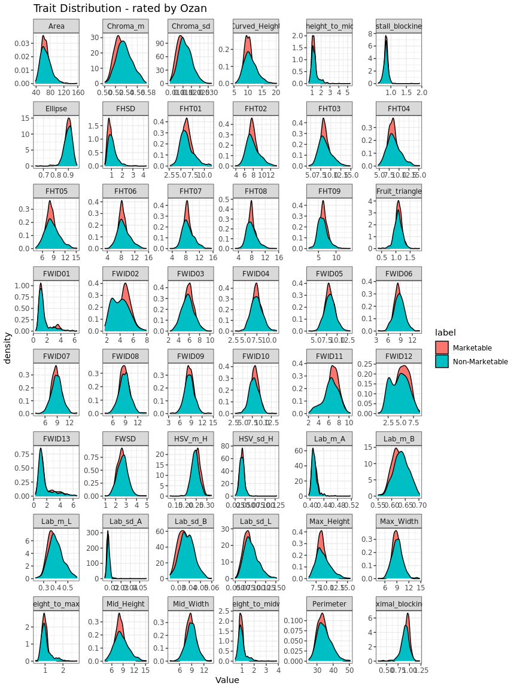

Fruit Quality Rating: Internal Rating Example
================

# Overview

- 200 Images with muliple peppers per imaged is rated internally by
  Kyle, natalie and Ozan
- 2 rating schemes are used: binary (marketable and Non-marketable) and
  rating with 3 categories (Poor, Average, Ideal)
- Approximately 1000 pepper images are rated
- The rating data then is merged with the digital phenotypes
- The main goal here is to assess the rating agreement (di agreement)
  across raters and assess the divergence between having binary ratings
  vs ratings with three categories.

# Data Characteristics

    ## # A tibble: 3 x 3
    ## # Groups:   rater [3]
    ##   rater   three   two
    ##   <chr>   <int> <int>
    ## 1 Kyle     1058  1035
    ## 2 Natalie  1091  1056
    ## 3 Ozan     1051  1087

- Number of objects (`digital_objects`) that got rated varies across
  raters as well across rating systems
- Maybe due to not succsessfully being merged by the digital pgenotype
  data?

<!-- -->

    ## # A tibble: 6 x 4
    ## # Groups:   rater [3]
    ##   rater   rating_system N_image N_dig.Obj
    ##   <chr>   <chr>           <int>     <int>
    ## 1 Kyle    three             187      1058
    ## 2 Kyle    two               182      1035
    ## 3 Natalie three             191      1091
    ## 4 Natalie two               188      1056
    ## 5 Ozan    three             187      1051
    ## 6 Ozan    two               191      1087

- Or the main reason here is that raters are not rating the whole set of
  images? need to sort out the main reason of missing ratings being
  merging issue or misisng rating issue.

``` r
df %>%
  filter(rating_system == "three") %>%
  .$label %>%
  table()
```

    ## .
    ## Quality - Average   Quality - Ideal    Quality - Poor 
    ##              1438               242              1520

- Three category naming convention seems consistent

``` r
df %>%
  filter(rating_system == "two") %>%
  .$label %>%
  table()
```

    ## .
    ##     Marketable Non-marketable Non-Marketable 
    ##           1026            904           1248

- Need to make the `Non-Marketable` tag consistent

# Binary ratings

- For now take a look at the peppers that are commonly rated and discard
  O’wise
- 3178 - 2922 = 256 objects are discarded for two category ratings

<!-- -->

``` r
# 100% agrrement
df_two %>%
  group_by(digital_object) %>%
  summarise(avg_r = mean(rating),
            agree = ifelse(avg_r %in% c(0,1), 1, 0)) %>%
  .$agree %>%
  table() %>%
  prop.table()
```

    ## .
    ##         0         1 
    ## 0.4383984 0.5616016

- There is 56% full agreement of marketable and non-marketable peppers.

<!-- -->

- Kyle and ozan seems to have similar binary ratings where as Natalie
  seems to be more conservative assigning Marketability tag.

Next we look into how each raters rating compares with the digital
Phenotypes:

## Ozan

<!-- -->

## Kyle

<!-- -->

## Natalie

<!-- -->

# Three category ratings

``` r
df_three <- df %>%
  filter(rating_system == "three") %>%
  group_by(digital_object) %>%
  mutate(N = n()) %>%
  filter(N == 3) %>%
  ungroup() %>%
  select(-N) %>%
  mutate(rating = case_when(
    label == "Quality - Poor" ~ 0, 
    label == "Quality - Average" ~ 0.5,
    TRUE ~ 1
  ))
```

- For now take a look at the peppers that are commonly rated and discard
  O’wise
- 3200 - 2985 = 215 lines are discarded

<!-- -->

``` r
# 100% agrrement
df_three %>%
  group_by(digital_object) %>%
  summarise(avg_r = mean(rating),
            agree = ifelse(avg_r <= 0.2 | avg_r >= 0.8, 1, 0)) %>%
  .$agree %>%
  table() %>%
  prop.table()
```

    ## .
    ##         0         1 
    ## 0.5316583 0.4683417

- There is 47% full agreement of marketable and non-marketable peppers.

<!-- -->

- Kyle and ozan seems to have similar binary ratings where as Natalie
  seems to be more conservative assigning Marketability tag.

Next we look into how each raters rating compares with the digital
Phenotypes:

## Ozan

<!-- -->

## Kyle

<!-- -->

## Natalie

<!-- -->

# Binary vs Three category rating Comparison

``` r
df_dif <- df_two %>%
  bind_rows(df_three) %>%
  group_by(rating_system, digital_object) %>%
  summarise(mean_rating = mean(rating)) %>%
  spread(rating_system, mean_rating) %>%
  mutate(dif = abs(three-two)) 

df_dif %>%
  ggplot(., aes(x = dif)) +
  geom_histogram(fill = "lightblue") +
  theme_minimal()
```

<!-- -->

``` r
df_dif %>%
  mutate(agree = ifelse(dif < 0.4, 1, 0)) %>%
  .$agree %>%
  table() %>%
  prop.table()
```

    ## .
    ##          0          1 
    ## 0.05191874 0.94808126

- There is 95% agrrement on binary vs three category ratings when the
  threhold of acceptance is 0.4 on the average rating.

``` r
# disagreement on the mean rating cat 2 vs 3 larger than 0.4
df_dif_great = df_dif %>%
  filter(dif > 0.4)

df_two %>%
  bind_rows(df_three) %>%
  filter(digital_object %in% df_dif_great$digital_object) %>%
  select(digital_object, label, rating_system, rater) %>%
  spread(rating_system, label) 
```

    ## # A tibble: 138 x 4
    ##    digital_object rater   three             two           
    ##             <dbl> <chr>   <chr>             <chr>         
    ##  1           7871 Kyle    Quality - Average Marketable    
    ##  2           7871 Natalie Quality - Average Marketable    
    ##  3           7871 Ozan    Quality - Average Marketable    
    ##  4           7874 Kyle    Quality - Average Marketable    
    ##  5           7874 Natalie Quality - Poor    Marketable    
    ##  6           7874 Ozan    Quality - Average Marketable    
    ##  7           7875 Kyle    Quality - Average Marketable    
    ##  8           7875 Natalie Quality - Poor    Marketable    
    ##  9           7875 Ozan    Quality - Ideal   Marketable    
    ## 10           7876 Kyle    Quality - Average Non-Marketable
    ## # … with 128 more rows
