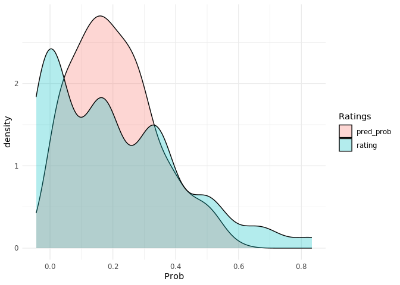

Fruit Quality Rating: Internal Rating Post Training
================

# Overview

- This report examines the nternal rating characteristics after the
  training
- 200 Images with muliple peppers per imaged is rated internally by
  Kyle, Natalie and Ozan
- Rating with 3 categories (Poor, Average, Ideal) are used
- Approximately 1000 pepper images are rated
- The rating data then is merged with the digital phenotypes

# Data Characteristics

Below is the number of images as well as the individual papers rated by
each rater:

    ## # A tibble: 3 x 4
    ## # Groups:   rater [3]
    ##   rater   rating_system N_image N_dig.Obj
    ##   <chr>   <chr>           <int>     <int>
    ## 1 Kyle    three             189      1066
    ## 2 Natalie three             192      1099
    ## 3 Ozan    three             191      1087

Below shows the total (for three raters) category rating distributions:

``` r
df %>%
  filter(rating_system == "three") %>%
  .$label %>%
  table()
```

    ## .
    ## Average   Ideal    Poor 
    ##    1075     102    2075

# Three category ratings

``` r
# 90 objects were discarded as they only have 2 raters
df_three <- df %>%
  group_by(digital_object) %>%
  mutate(N = n()) %>%
  filter(N == 3) %>%
  ungroup() %>%
  select(-N) %>%
  mutate(rating = case_when(
    label == "Poor" ~ 0, 
    label == "Average" ~ 0.5,
    TRUE ~ 1
  ))
```

- For now take a look at the peppers that are commonly rated and discard
  O’wise
- 90 peppers are discarded as they only had 2 ratings.

<!-- -->

``` r
# 100% agrrement
df_three %>%
  group_by(digital_object) %>%
  summarise(avg_r = mean(rating),
            agree = ifelse(avg_r <= 0.2 | avg_r >= 0.8, 1, 0)) %>%
  .$agree %>%
  table() %>%
  prop.table()
```

    ## .
    ##         0         1 
    ## 0.3368121 0.6631879

- There is 66.3% full agreement on Poor, Average and Ideal peppers.

<!-- -->

- Kyle and Ozan seems to have similar binary ratings where as Natalie
  seems to be more conservative assigning Marketability tag.

Next we look into how each raters rating compares with the digital
Phenotypes:

## Ozan

<!-- -->

## Kyle

<!-- -->

## Natalie

<!-- -->

# Pre vs Post Training Comparison:

Average Fruit Quality assignment per rater, pre vs post tarining:

    ## # A tibble: 3 x 3
    ## # Groups:   rater [3]
    ##   rater   Pre_Training Post_training
    ##   <chr>          <dbl>         <dbl>
    ## 1 Kyle          0.316         0.299 
    ## 2 Natalie       0.0884        0.0953
    ## 3 Ozan          0.488         0.188

<!-- -->

# Naive Model

Here we taring a very simple `XGBOOST` model, where:

- randomly select 75% of the peppers to be in the training sample
- randomly select 25% of the pepper to be in the test data
- train model with training data and look at the model performance on
  the test data:

Naive model accuracy:

    ## [1] 0.7490494

Average rating vs predicted probability of fruit quality:

<!-- -->

# Further Cosiderations:

- Design the image pool in a way to balance classes, i.e., strategies to
  incorporate more “ideal” quality pepper in the pool of images to be
  rated.
